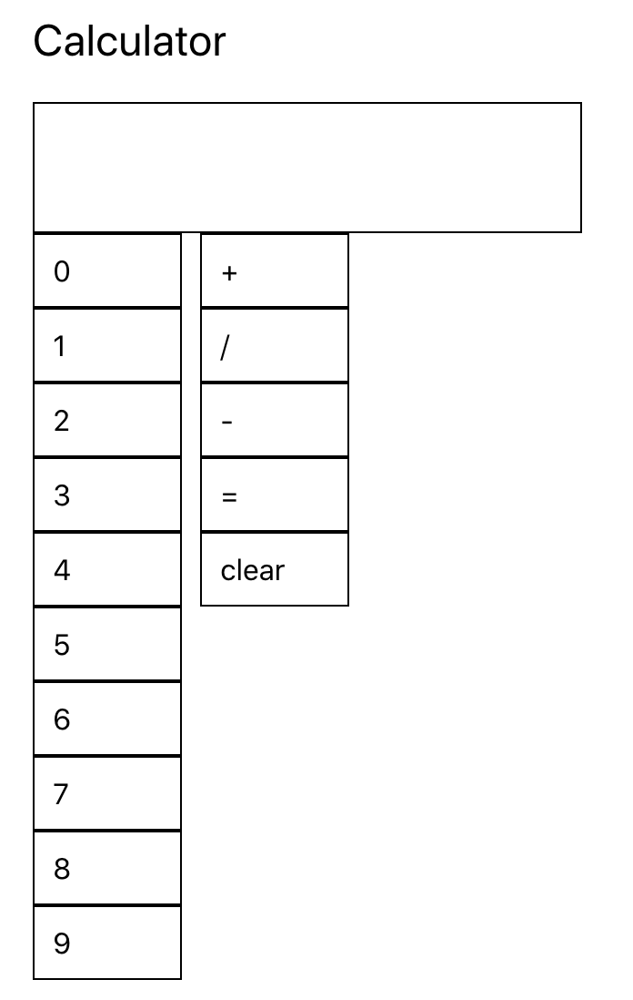

## Assignment

In this assignment you will start with a basic calculator and style it using `CSS`, `inline styles`, and `styled-components`.

As you can tell the current layout needs a lot of styling work. Modify the layout, components, and calculator logic however you want. **Everything is free game!** 

## Notes
Since **"everything is free game"**, I included bootstrap's columns and rows for the layout. The rest of my style is a mix of `inline styles` and `styled-components`. 

## Deliverable

1. Style the calculator however you want. Feel free to use any colors, layout, and animations that you would like. Be as creative as you want.
2. Define all PropTypes for `Number`, `Operator`, and `Screen` components. If you add more components make sure to define the PropTypes.
3. Deploy your application using any method you want (repo is setup for Github actions). Add the url: URL_TO_PROJECT

### Deployment Instructions (Github actions)

- Go to `Settings`
- Go to `Pages`
- in `Source`, select `gh-pages` branch
- Click Save
- In `package.json`, add a new key/value as: `"homepage": "https://prof-tejera.github.io/<repo>"`

Once the `build-deploy` action finishes running, the app should be live
at `https://prof-tejera.github.io/<repo>`

For other ways to deploy see https://github.com/prof-tejera/react-deployment-code

## Bonus Points

1. :white_check_mark: Add support for decimal places.
2. :white_check_mark: Add support for negative numbers.
3. :white_check_mark: How are you handling the overflow of text? How might we handle situations in which we are dealing with really large numbers?
    - A horizontal, custom scroll bar pops up when dealing with overflow. This allows the user to enter as many numbers as possible and, in turn, calculate values with the utmost precision. It is not the most aesthetically pleasing solution, though it is a fairly precise one. 
    — Another possible solution: The iPhone calculator, which my design was inspired by, scales down the original font size when a large number gets inputted. It doesn't accept numbers larger than 9 digits long. The return value of large numbers is handled via scientific E notation — e.g., "10e5". In JavaScript, I'd likely implement a similar solution by making use of the `toExponetial()` method. 

## How to run the project

`npm i && npm start`

Open [http://localhost:3000](http://localhost:3000)
